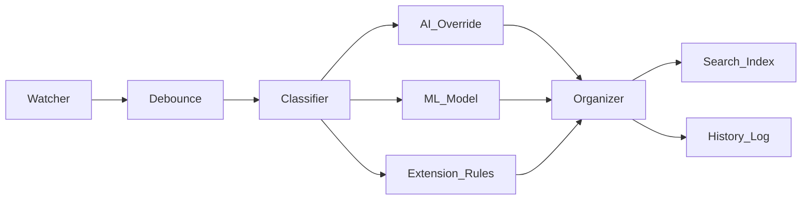

# F.O.R.G.E. — Fixes & Improvements Roadmap 🔧

> Built by Jay — 2nd year IT student, Philippines
> First real project. Made in ~12 hours. AI-assisted, all decisions understood and validated throughout.
> Cross-platform: tested on Windows + GitHub Actions (Linux/macOS)

---

## Phase 0 — Before Anything Else (Do These Now)

Quick wins and things that are visibly broken in normal use.

### 0.1 Verify Watchdog on Windows
- **Where:** `src/watcher.py`
- **What:** `ReadDirectoryChangesW` (Windows watchdog backend) has known quirks — rapid events can get coalesced or dropped, and permission handling differs from Linux/macOS `inotify` and macOS `FSEvents`.
- **What to do:** Run `forge watch ~/Downloads` on Windows, drop 5–10 files in rapidly, confirm all are processed. Check the debounce re-queue on `PermissionError` fires correctly. The 3-second stability window likely smooths over most Windows weirdness — just needs confirmation.

### 0.2 Document AI Assistance Honestly
- **Where:** `README.md`
- **What:** Add one line acknowledging AI assistance. Transparent, professional, accurate.
- **What to add:**
  ```
  > Built with AI assistance (Claude) — architecture decisions, implementation, and design were validated throughout.
  ```
- Notable human decisions worth calling out explicitly:
  - 3-second debounce window for in-progress download safety
  - `.crdownload` / `.part` / `.tmp` extension filtering
  - 0.40 ML confidence threshold
  - 3-tier classification hierarchy (AI → ML → extension fallback)

---

## Phase 1 — Critical Fixes (Broken in Real Use)

### Fix 1: FAISS Index Invalidation
- **Priority:** Critical
- **Where:** `src/search.py` — `build_index()` and `load_index()`
- **Problem:** The search index is additive only. When files are moved, renamed, or deleted, their entries remain in the FAISS index and metadata pickle. Over time the index accumulates stale entries that point to non-existent paths, silently returning dead results.
- **Fix:** Store a file hash (`mtime + size`) alongside each metadata entry. On every `build_index()` call, walk the existing metadata, check if each path still exists and matches its stored hash, and remove stale entries before adding new ones. Since `FAISS IndexFlatL2` doesn't support deletion, rebuild the index from surviving entries.

```python
import hashlib

def _file_hash(self, file: Path) -> str:
    stat = file.stat()
    return f"{stat.st_mtime}_{stat.st_size}"

def _rebuild_clean_index(self):
    """Remove stale entries and rebuild FAISS index from clean metadata."""
    valid_metadata = {}
    valid_embeddings = []
    for idx, meta in self.metadata.items():
        path = Path(meta["path"])
        if path.exists() and self._file_hash(path) == meta.get("hash"):
            valid_metadata[len(valid_embeddings)] = meta
            embedding = self.model.encode([meta["snippet"]])[0]
            valid_embeddings.append(embedding)
    self.index = faiss.IndexFlatL2(self.dimension)
    if valid_embeddings:
        arr = np.array(valid_embeddings).astype('float32')
        self.index.add(arr)
    self.metadata = valid_metadata
    self.save_index()
```

> Store embeddings in a separate `.npy` file alongside metadata so you can filter without re-encoding everything.

---

## Phase 2 — High Priority (Correct But Limited)

### Fix 2: Single Undo Level — No Stack
- **Priority:** High
- **Where:** `src/utils.py` — `save_history()` and `undo_last()`
- **Problem:** `undo_last()` reads the most recent `history_*.json` file and deletes it after reverting. There is no stack. Running undo twice does nothing useful — the second call undoes the operation before the one you just undid, with no warning. The README implies a richer undo system than exists.
- **Fix:** Maintain a pointer file (`history/.undo_cursor`) that tracks which log was last undone. Undo walks the cursor backwards; redo walks it forwards. Don't delete logs on undo — mark them as undone instead.

```python
def undo_last() -> None:
    history_dir = Path(__file__).parent.parent / "history"
    cursor_file = history_dir / ".undo_cursor"
    logs = sorted(history_dir.glob("history_*.json"))
    if not logs:
        console.print(" [yellow]No history logs found.[/yellow]")
        return
    if cursor_file.exists():
        cursor = int(cursor_file.read_text().strip())
    else:
        cursor = len(logs)
    if cursor == 0:
        console.print(" [yellow]Nothing left to undo.[/yellow]")
        return
    cursor -= 1
    last_log = logs[cursor]
    # ... perform revert logic ...
    cursor_file.write_text(str(cursor))
    console.print(f" [#28c840]✔ Undone:[/#28c840] {last_log.name}")
```

> Add a `forge redo` command that increments the cursor and re-applies the log.

---

### Fix 3: ML Trains on Filenames Only, Not Content
- **Priority:** High
- **Where:** `src/ml.py` — `extract_features()`
- **Problem:** `MLClassifier.extract_features()` strips the filename of numbers and special characters and feeds it to TF-IDF. A file named `document_1.pdf` or `screenshot_2024.png` produces nearly identical feature strings regardless of content. The model is fundamentally limited for generically-named files.
- **Fix:** Pull the first N characters of file content (reusing `extract_text()` from `llm.py`) and append it to the feature string. Gate it behind a flag so training stays fast when content extraction isn't needed.

```python
def extract_features(self, file_path: Path, use_content: bool = False) -> str:
    clean_name = self._clean_filename(file_path.name)
    ext = file_path.suffix.lower().replace('.', '')
    base = f"{clean_name} {ext}"
    if use_content:
        try:
            from src.llm import extract_text
            content = extract_text(file_path, max_chars=500)
            content_clean = re.sub(r'[^a-zA-Z\s]', ' ', content).lower()
            base = f"{base} {content_clean}"
        except Exception:
            pass  # Graceful degradation — filename features still used
    return base
```

> Update `train()` and `predict()` to pass `use_content=True` when available. This meaningfully improves accuracy for documents, code files, and anything with readable text.

---

## Phase 3 — Medium Priority (Quality & Correctness)

### Fix 4: Serial Ollama Calls — No Concurrency
- **Priority:** Medium
- **Where:** `src/organizer.py` — the main `for file in files` loop
- **Problem:** The file loop calls `local_llm.analyze_and_rename(file, ...)` synchronously for every file. On a folder with 200 files, this is 200 sequential LLM calls with no parallelism. Even on a fast local machine this will take minutes.
- **Fix:** Use `concurrent.futures.ThreadPoolExecutor` to process files in parallel. Cap `max_workers` at 4 to avoid overwhelming the local Ollama server. Make it configurable via `config.json`.

```python
from concurrent.futures import ThreadPoolExecutor, as_completed

def _analyze_file(file, local_llm, categories, use_ai, ai_rename):
    if local_llm is None:
        return file, None, None
    cat_guess, new_name = local_llm.analyze_and_rename(file, list(categories.keys()))
    return file, cat_guess if use_ai else None, new_name if ai_rename else None

# In organize():
ai_results = {}
if local_llm is not None:
    with ThreadPoolExecutor(max_workers=4) as executor:
        futures = {executor.submit(_analyze_file, f, local_llm, categories, use_ai, ai_rename): f for f in files}
        for future in as_completed(futures):
            file, cat, name = future.result()
            ai_results[file] = (cat, name)
```

---

### Fix 5: `pyproject.toml` vs README Dependency Mismatch
- **Priority:** Medium
- **Where:** `pyproject.toml`
- **Problem:** `pyproject.toml` lists `scikit-learn` and `joblib` as hard dependencies, meaning `pip install file-organizer` will always install them. The README explicitly calls them optional and says the core tool works without them. These contradict each other.
- **Fix:** Move AI/ML packages to `[project.optional-dependencies]`:

```toml
[project]
dependencies = [
    "typer",
    "rich",
    "watchdog"
]

[project.optional-dependencies]
ml = [
    "scikit-learn",
    "joblib"
]
ai = [
    "sentence-transformers",
    "faiss-cpu",
    "ollama",
    "pytesseract",
    "Pillow",
    "PyPDF2"
]
full = [
    "scikit-learn",
    "joblib",
    "sentence-transformers",
    "faiss-cpu",
    "ollama",
    "pytesseract",
    "Pillow",
    "PyPDF2"
]
```

Users can then do:
- `pip install file-organizer` — core only
- `pip install file-organizer[ml]` — adds ML classifier
- `pip install file-organizer[full]` — everything

---

### Fix 6: No Test Coverage for AI/Search Paths
- **Priority:** Medium
- **Where:** `tests/`
- **Problem:** `tests/test_organizer.py` covers basic file moving. `tests/test_integration.py` is 1177 bytes — essentially a smoke test. There are zero tests for `SemanticSearch`, `MLClassifier`, `LocalLLM`, or the watchdog debounce logic. The most complex parts of the codebase are completely untested.
- **Fix:** Add targeted unit tests with mocked dependencies so tests run without Ollama/FAISS installed:

```python
# tests/test_search.py
from unittest.mock import MagicMock, patch
from pathlib import Path

def test_search_returns_empty_on_empty_index():
    with patch('src.search.SentenceTransformer'):
        from src.search import SemanticSearch
        searcher = SemanticSearch(index_dir="/tmp/test_index")
        results = searcher.search("tax forms from last year", top_k=3)
        assert results == []

def test_stale_metadata_excluded(tmp_path):
    # Create a file, index it, delete it, rebuild — should not appear in results
    ...

# tests/test_ml.py
def test_predict_returns_none_without_model():
    from src.ml import MLClassifier
    clf = MLClassifier(model_path=Path("/nonexistent/model.joblib"))
    result, conf = clf.predict(Path("test_document.pdf"))
    assert result is None
    assert conf == 0.0
```

---

## Phase 4 — Low Priority (Polish)

### Fix 7: Watcher Doesn't Ignore `.git` Directories
- **Priority:** Low
- **Where:** `src/watcher.py` — `_add_file()`
- **Problem:** `search.py` correctly skips `.git` in `build_index()`. But `StableFileHandler` in `watcher.py` only skips hidden files by name prefix (`file.name.startswith(".")`). If you watch a directory containing a git repo, `.git/index` and other git internals will trigger the handler.
- **Fix:** Check for `.git` anywhere in the file's path parts, mirroring what `search.py` already does:

```python
def _add_file(self, file_path: Path) -> None:
    if file_path.name.startswith("."):
        return
    if ".git" in file_path.parts:  # Add this
        return
    if file_path.suffix.lower() in self.excluded:
        return
    if file_path.suffix.lower() in self.temp_extensions:
        return
    with self.lock:
        self.pending_files[file_path] = time.time()
```

---

### Fix 8: Search Score Formula Is Uncalibrated
- **Priority:** Low
- **Where:** `src/main.py` — `search_command()`
- **Problem:** The match strength displayed to users is `max(0, 100 - distance * 50)`. This is a heuristic with no mathematical basis. L2 distances in 384-dimensional embedding space aren't bounded in a predictable range, so this formula will show wildly different score distributions depending on content. A score of "82.3" implies precision that doesn't exist.
- **Fix:** Normalize embeddings before storing and convert to cosine similarity:

```python
# In search.py build_index() — normalize before adding to FAISS
embedding = self.model.encode([text])[0]
embedding = embedding / np.linalg.norm(embedding)  # L2 normalize
new_embeddings.append(embedding)

# Then cosine similarity = 1 - (L2_distance² / 2)
# Range is 0.0 to 1.0 — actually meaningful
cosine_sim = 1 - (distance ** 2) / 2
```

> Or just be honest: display `Distance: {distance:.3f} (lower is better)` instead of a fake percentage score.

---

## Phase 5 — Short Term Improvements (When You Have Time)

### Fix 9: Dry-Run Mode
- **Where:** `src/organizer.py` + `src/main.py`
- **What:** `forge organize --dry-run` previews every action without touching files. Shows what would move where, what would be renamed, what categories would be assigned.
- **Why it matters:** User trust. First time someone runs FORGE on a messy folder with 500 files, they won't run it blind. This is the difference between "I'll try it" and "I'm scared to use it."
- **How:** Gate every `shutil.move()` and `Path.rename()` behind a `dry_run: bool` flag. Print intended actions with Rich instead of executing them.

---

### Fix 10: Structured Logging
- **Where:** New file `src/logging.py`, touch all modules
- **What:** Replace scattered `console.print()` calls with a proper logging layer — INFO/WARN/ERROR levels, written to `~/.forge/logs/` with timestamps.
- **Why it matters:** Right now if something silently fails (OCR error, AI fallback, permission issue) you have no record of it. Structured logs make debugging real use possible.
- **How:** Wrap Python's built-in `logging` module, write JSON lines to a rotating log file, keep Rich console output for UX but log everything to disk separately.

---

### Fix 11: Config Validation
- **Where:** `src/utils.py` or new `src/config.py`
- **What:** Validate `categories.json` and `config.yaml` on startup — catch typos, missing fields, bad paths before they cause weird runtime errors.
- **Why it matters:** Right now a malformed config silently breaks classification. A user editing categories won't get a helpful error, just unexpected behavior.
- **How:** Use `pydantic` or plain dataclasses with type hints. Print clear validation errors on startup before doing anything else.

---

### Fix 12: Compatibility Matrix in README
- **Where:** `README.md`
- **What:** Add a table showing what's tested on Windows / macOS / Linux and which features work where.
- **Why it matters:** You built this cross-platform, tested on Windows + GitHub Actions. That's real work — document it. Saves users from filing issues about expected platform gaps.

| Feature | Windows | macOS | Linux |
|---------|:-------:|:-----:|:-----:|
| Core organize | ✅ | ✅ | ✅ |
| File watcher | ⚠️ needs verify | ✅ | ✅ |
| OCR rename | ✅ | ✅ | ✅ |
| Semantic search | ✅ | ✅ | ✅ |
| Ollama LLM | ✅ | ✅ | ✅ |

---

### Fix 13: Architecture Diagram
- **Where:** `README.md` + `/assets/`
- **What:** A simple flow diagram showing how components connect.
- **Why it matters:** The architecture is actually good — three-tier classification, watcher feeding pipeline, search indexing separately. It deserves to be visible. Makes the project look far more serious to anyone reading it.
- **How:** Mermaid renders natively on GitHub, no external tools needed:



---

## Summary Table

| Phase | # | Fix | File | Priority |
|-------|---|-----|------|----------|
| 0 | — | Verify watchdog on Windows | `watcher.py` | Do now |
| 0 | — | Document AI assistance | `README.md` | Do now |
| 1 | 1 | FAISS index invalidation | `search.py` | Critical |
| 2 | 2 | Undo stack (not single level) | `utils.py` | High |
| 2 | 3 | ML content-aware features | `ml.py` | High |
| 3 | 4 | Concurrent Ollama calls | `organizer.py` | Medium |
| 3 | 5 | Optional deps in pyproject.toml | `pyproject.toml` | Medium |
| 3 | 6 | Test coverage for AI/search | `tests/` | Medium |
| 4 | 7 | Watcher `.git` filtering | `watcher.py` | Low |
| 4 | 8 | Search score calibration | `main.py` | Low |
| 5 | 9 | Dry-run mode | `organizer.py` | Short term |
| 5 | 10 | Structured logging | new `logging.py` | Short term |
| 5 | 11 | Config validation | `utils.py` | Short term |
| 5 | 12 | Compatibility matrix in README | `README.md` | Short term |
| 5 | 13 | Architecture diagram | `README.md` | Short term |

---

## Future Ideas (No Timeline)

Only worth considering if FORGE becomes more than a personal tool.

- **`forge redo` command** — pairs with undo stack fix (#2), lets you undo an undo
- **Config hot-reload** — change `categories.json` without restarting the watcher
- **Duplicate detection** — hash-based dedup when organizing, flag files that already exist at destination
- **AI provider abstraction** — `InferenceProvider` base class so you can swap Ollama for OpenAI or anything else without touching organizer logic. Only worth it if you plan to support multiple backends
- **Plugin system** — custom classifiers, OCR adapters, organization rules as plugins. Serious scope, only if FORGE grows a user base
- **Internal event bus** — `file_detected`, `classification_complete`, `index_updated` events instead of direct coupling. Good architecture but overkill for a personal tool right now
- **GUI / tray app** — makes FORGE usable for non-technical people. Big lift, different project almost

---

## What Was Omitted From the Original Roadmap and Why

- **"Define Forge's Core Philosophy / rewrite description"** — omitted. You already know what it is: a local file organizer with optional AI. Do it when you're ready to share it publicly, not now.
- **"Central Pipeline Abstraction / Rule Engine / Event Bus"** — deferred to Future Ideas. These are refactors of working code into patterns. Don't add abstraction layers until the existing code is painful to change — that's the signal they're needed.
- **"Abstract AI Providers"** — deferred. Good idea, but FORGE only uses Ollama right now. Abstract when you add a second provider, not before. Premature abstraction is a real cost.
- **"Add User Modes (Beginner/Advanced/Developer)"** — omitted. Adds complexity to the CLI for marginal benefit on a personal tool.
- **"Separate business logic from watchers"** — omitted. Already mostly true. Minor cleanup if anything, not a phase of work.
- **"Standalone executable / Docker / package managers"** — omitted. Premature packaging. Get the tool stable first. `pip install` is enough for now.
- **"Define what Forge should NOT become"** — omitted as a task because it's a mindset not a deliverable. The core qualities — local-first, deterministic-first, AI optional, modular — are worth preserving. Just don't turn it into a todo item.
