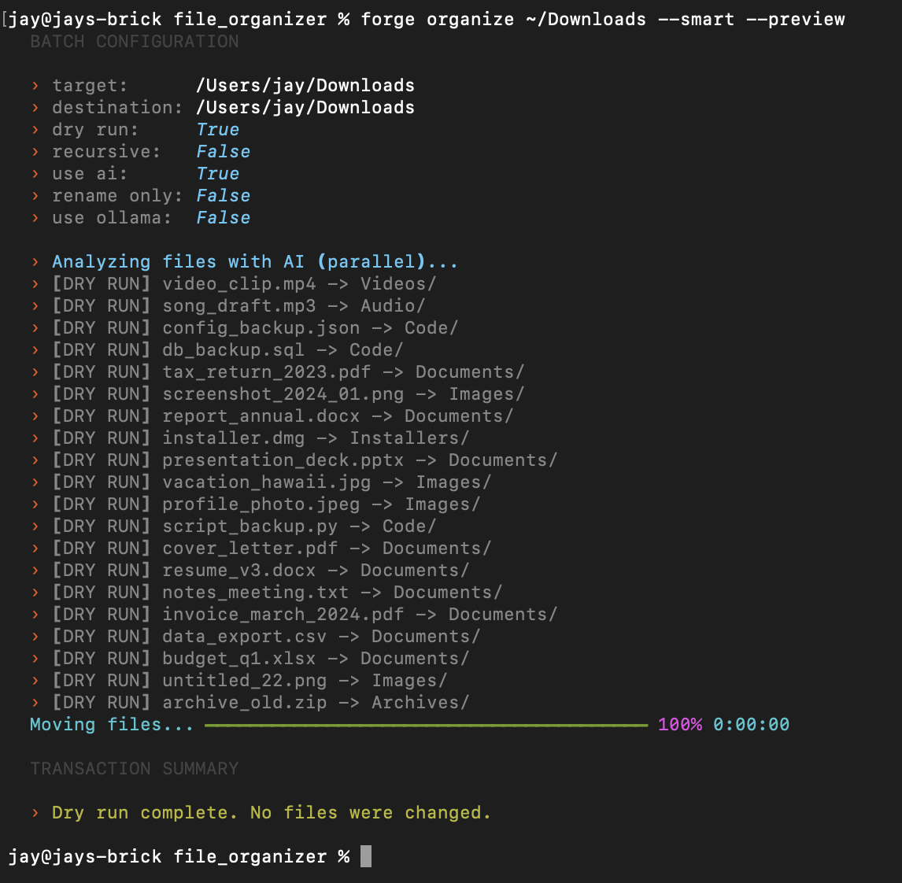
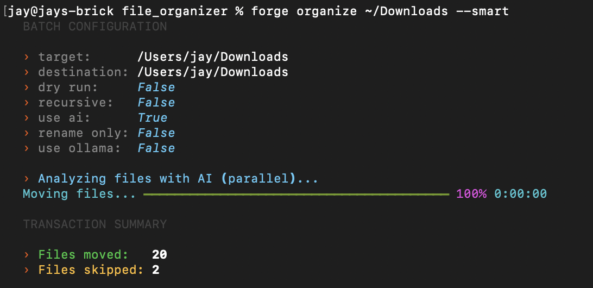
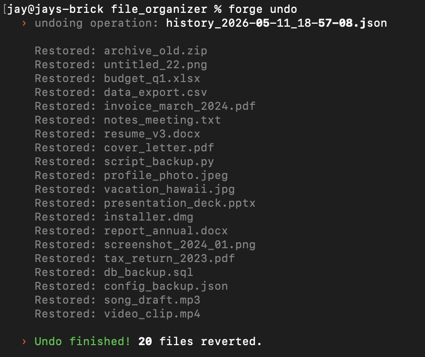
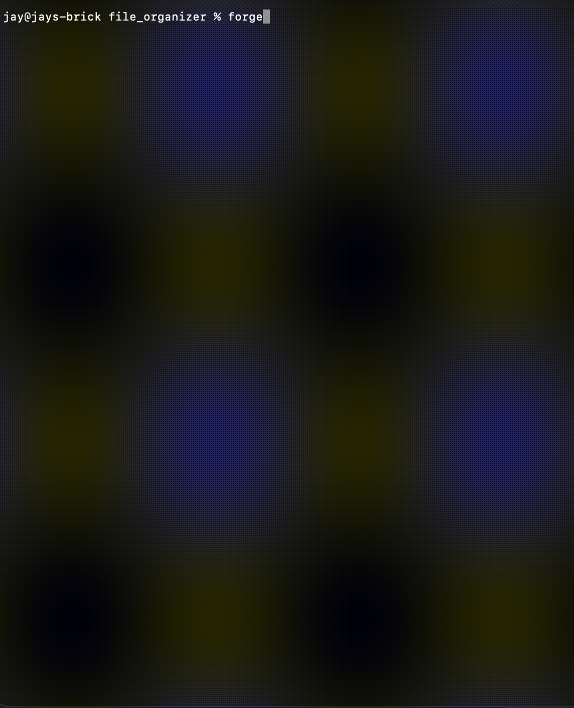

# F.O.R.G.E.

[](https://github.com/c4nt5er3d/forge/actions/workflows/test.yml)


**F.O.R.G.E. is a local-first CLI that safely previews, organizes, renames, searches, and undoes filesystem cleanup.**

It is built for messy folders like Downloads: inspect what will happen, move or copy files into useful categories, rename documents when the content is trustworthy, and undo the operation if you do not like the result.

> Note: This project started as a simple file organizer script, so the repository folder name remains `file_organizer` even though the CLI command is `forge`.

## Quickstart

```bash
git clone <https://github.com/c4nt5er3d/forge>
cd file_organizer
python3 -m venv .venv
source .venv/bin/activate
python -m pip install -e ".[dev]"
forge --help
```

First safe command:

```bash
forge organize ~/Downloads organized --preview
```

Nothing moves in preview mode. When the plan looks right:

```bash
forge organize ~/Downloads organized
```

Undo is built in:

```bash
forge undo --preview
forge undo --steps 1
```

## Demo

Use the committed demo fixtures and these commands to record a deterministic portfolio run:

```bash
python demo/setup_demo_data.py
forge organize demo/messy demo/organized --preview
forge organize demo/messy demo/organized
forge undo --preview
forge undo --steps 1
```

Expected media paths:

```text
docs/demo/forge-preview.png
docs/demo/forge-organize.png
docs/demo/forge-undo.png
docs/demo/forge-demo.gif
```

Demo placeholders (replace once recorded):






## Features

- **Safe preview**: See planned moves, copies, or renames before touching files.
- **Undo support**: Revert recent move/copy transactions from local history.
- **Collision handling**: Existing files are protected with numbered filenames like `report_1.pdf`.
- **Smart organize**: Categorize by extension rules, optional ML model, or optional local AI.
- **Smart rename**: Rename from trustworthy extracted text; noisy, empty, binary, and unsupported files stay unchanged.
- **Semantic search**: Optional vector search for natural-language file lookup.
- **Local-first design**: Core commands run locally without cloud APIs.

## Common Commands

```bash
# Move files into category folders
forge organize <source_folder> <destination_folder>

# Preview without changing files
forge organize <source_folder> <destination_folder> --preview

# Copy instead of move
forge copy <source_folder> <destination_folder>

# Rename files in place using quality-gated local extraction
forge rename <folder> --preview

# Monitor a folder for new files
forge watch <source_folder> <destination_folder>

# Build and query semantic search index
forge index <folder>
forge search "tax forms from last year"
```

## Optional AI

The core workflow does not require AI dependencies.

Install optional groups only when you need them:

```bash
python -m pip install -e ".[ml]"
python -m pip install -e ".[ai]"
python -m pip install -e ".[full]"
```

- **Tesseract OCR** improves text extraction from images for smart rename/search. If Tesseract is missing or an image has no readable text, FORGE skips the rename instead of inventing a bad filename.
- **Ollama** enables local LLM-assisted rename/category suggestions with `forge rename <folder> --local`.
- **Sentence Transformers + FAISS** power semantic search with `forge index` and `forge search`.

## Safety Guarantees

- Preview mode is non-mutating.
- Undo history is written for move/copy operations.
- File collisions are resolved before writing.
- Hidden files and `.git` internals are skipped.
- Smart rename prefers skipping over producing low-confidence or artifact-based names.

## Troubleshooting

**`forge` command not found**

Run editable install from project root:

```bash
python -m pip install -e ".[dev]"
forge --help
```

**Tesseract OCR not working for images**

FORGE still runs core organize/copy/undo commands without OCR, but image text extraction needs both Python packages and the system binary:

```bash
# Python deps
python -m pip install -e ".[ai]"

# Verify the system binary exists
tesseract --version
```

If `tesseract` is not found, install it (examples):

- macOS (Homebrew): `brew install tesseract`
- Ubuntu/Debian: `sudo apt-get update && sudo apt-get install -y tesseract-ocr`

**Ollama local mode unavailable**

Normal rename still works without Ollama (`forge rename <folder>`). `--local` needs the Ollama daemon and model:

```bash
ollama --version
ollama serve
ollama pull llama3.2
forge rename <folder> --local
```

If `ollama.chat` fails, check that `ollama serve` is running in another terminal and the model is pulled.

**Semantic search returns no results**

Install AI dependencies, build index, then query:

```bash
python -m pip install -e ".[ai]"
forge index <folder>
forge search "project notes"
```

**Permission errors**

Run against folders your user owns, or choose a writable destination. Preview mode is the safest first check.

## Development

```bash
python -m pip install -e ".[dev]"
ruff check src demo
python -m pytest tests/
```

## Release Notes

- Changelog: [CHANGELOG.md](CHANGELOG.md)
- Initial release notes: [RELEASE_NOTES_0.1.0.md](RELEASE_NOTES_0.1.0.md)

## Final Fresh-Clone Test

```bash
git clone <your-repo-url>
cd file_organizer
python3 -m venv .venv
source .venv/bin/activate
python -m pip install -e ".[dev]"
forge --help
ruff check src demo
python -m pytest tests/
python demo/setup_demo_data.py
forge organize demo/messy demo/organized --preview
```

Current version: **0.1.0**


