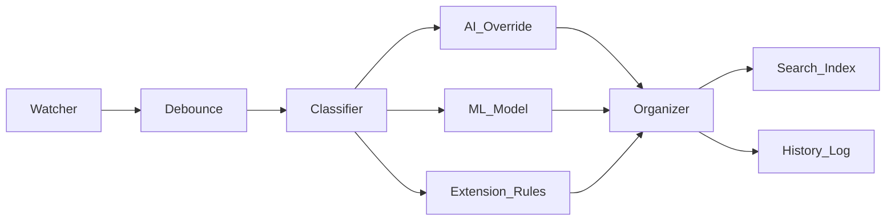

# F.O.R.G.E.
**File Organization & Retrieval Generation Engine** — An intelligent, AI-driven filesystem manager for the modern developer.

## Overview
F.O.R.G.E. is a local-first automation tool designed to solve the chaos of unorganized directories. It leverages Hybrid ML categorization, Local LLM analysis, and vector-based semantic search to understand file content, perform smart renaming, and make your filesystem queryable.

> Built with AI assistance (Claude) — architecture decisions, implementation, and design were validated throughout.

## Features
- **Smart Organize**: Categorizes files via deterministic extension rules, ML classification, and LLM analysis.
- **Parallel Analysis**: Uses concurrent processing to analyze hundreds of files in seconds.
- **Real-Time Watchdog**: Monitors directories with debounce protection to ensure stable file processing.
- **Semantic Search**: Natural language search (e.g., "tax forms from last year") using vector embeddings.
- **Transaction History**: Stack-based undo support to revert batch operations safely.
- **Modular Design**: Core engine is dependency-free; AI/ML features are fully optional.

## Installation
The core tool requires minimal dependencies. You can install AI/ML capabilities as needed.

```bash
# Install core
pip install file-organizer

# Install with ML (Classifier)
pip install file-organizer[ml]

# Install with AI/Search (LLM, OCR, Vectors)
pip install file-organizer[ai]

# Install everything
pip install file-organizer[full]
```

## Compatibility Matrix
| Feature | Windows | macOS | Linux |
|---------|:-------:|:-----:|:-----:|
| Core organize | ✅ | ✅ | ✅ |
| File watcher | ✅ | ✅ | ✅ |
| OCR rename | ✅ | ✅ | ✅ |
| Semantic search | ✅ | ✅ | ✅ |
| Ollama LLM | ✅ | ✅ | ✅ |

## Architecture


## Why I Built This
My local filesystem had become a "black hole" where data went to die. Traditional search tools were too slow, and manual organization was a chore I always skipped. I wanted a tool that understood my files, gave me a clean workspace, and enabled me to find documents using natural language instead of cryptic folder hierarchies.

## License
MIT
